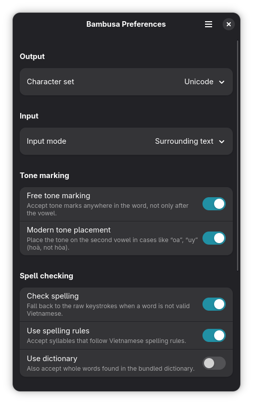

# ibus-bambusa

A simple, opinionated Vietnamese input method for **GNOME 50 or newer**.

`ibus-bambusa` is an [IBus](https://github.com/ibus/ibus) engine that turns
keystrokes into Vietnamese text — Telex, VNI, VIQR and the usual variants.

## Opinions

This project deliberately keeps a narrow scope. It does only what GNOME on
Wayland supports well, and nothing else:

- **Wayland only**, targeting what GNOME 50 (or newer) actually supports. No X11, no
  `XTest` key faking, no X11 clipboard or window introspection. If GNOME decides
  to re-introduce support X11, so will this app.
- **Native GNOME input switching**, adhering strictly to GNOME. Both global and
  per window switching method are provided.
- **Full charset output**: Unicode plus the legacy Vietnamese encodings
  (TCVN3, VNI-Win, VIQR, VISCII, VPS, BK HCM, Vietware, NCR, …).
- **Native libadwaita GUI.** Configuration lives in GSettings/dconf exposed
  via native gnome-control-center.
- **GNOME lifecycle**, providing support to active GNOME releases only. No plan
  to support releases that has reached EOL.

If you need the features that the app does not offer, please consider alternatives:

* [goxkey](https://github.com/huytd/goxkey)
* [ibus-typing-booster](https://github.com/mike-fabian/ibus-typing-booster)
* [ibus-m17n](https://github.com/ibus/ibus-m17n)
* [ibus-bamboo](https://github.com/BambooEngine/ibus-bamboo)
* [ibus-unikey](https://github.com/vn-input/ibus-unikey)
* [ibus-bogo](https://github.com/BoGoEngine/ibus-bogo)

## Credits

The Vietnamese composition logic is a direct port of the excellent
[BambooEngine](https://github.com/BambooEngine) projects:

- [`bamboo-core`](https://github.com/BambooEngine/bamboo-core) — the
  composition algorithm (tone/mark placement, spelling rules, input methods).
- [`ibus-bamboo`](https://github.com/BambooEngine/ibus-bamboo) — the IBus
  engine behaviour this project follows.

The port aims to match their behaviour closely; the upstream test corpus is
re-run against this implementation.

## Screenshots



## Layout

This is a Cargo workspace:

| Crate | What it is |
|-------|------------|
| `bambusa-core` | The composition engine: keystrokes → Vietnamese text. Pure, no I/O. |
| `ibus-zbus` | Engine-side IBus binding on zbus. |
| `ibus-bambusa` | The IBus engine binary. |

## Building

Requires Rust 1.96.0 (pinned via `rust-toolchain.toml`) and IBus. Installing
additionally needs Meson and Ninja.

### Develop

```sh
cargo build
cargo test
```

### Install

The engine is built and installed with Meson, which wraps Cargo:

```sh
meson setup builddir --buildtype=release --prefix=/usr
meson compile -C builddir
sudo meson install -C builddir
ibus restart
```

## License

GPLv3
